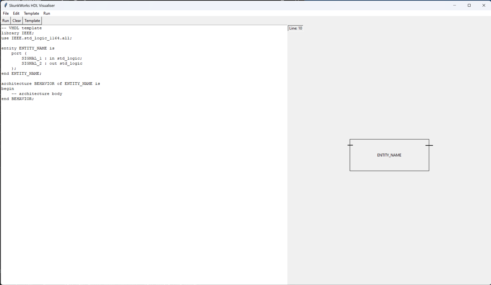

# hdl_visualiser
A python GUI for visualizing you hdl code, show I/Os, internal signals and architecture functionalities.
uses tkinter library.



To run, simply execute.
```python
python3 main.py
```
